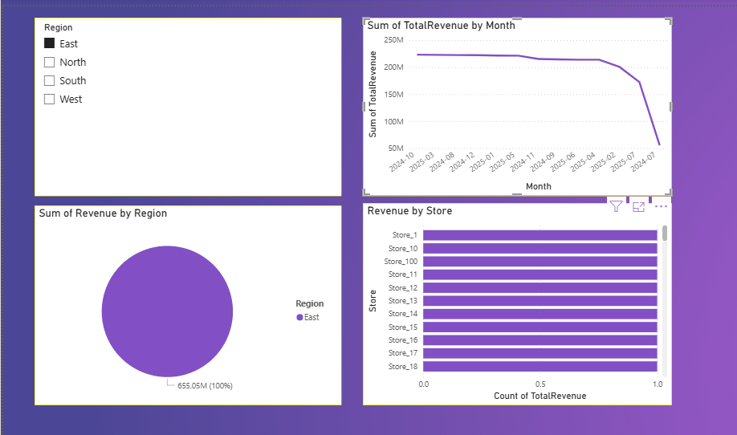
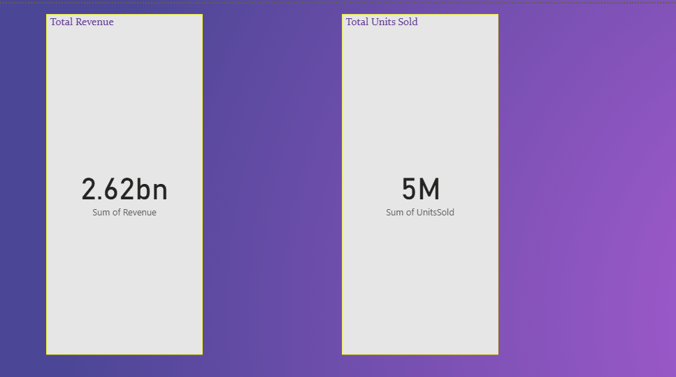

## 👤 Author

[](http://linkedin.com/in/shraddha-lahare-078518375)
[](https://github.com/shraddhalahare17)
[](https://github.com/shraddhalahare17/Sales-Performance-Optimization-Project/stargazers)
[](https://github.com/shraddhalahare17/Sales-Performance-Optimization-Project/network)
[](https://github.com/shraddhalahare17/Sales-Performance-Optimization-Project/watchers)

[](https://github.com/shraddhalahare17/Sales-Performance-Optimization-Project)
[](https://github.com/shraddhalahare17/Sales-Performance-Optimization-Project)
[](https://github.com/shraddhalahare17/Sales-Performance-Optimization-Project)

[](https://github.com/shraddhalahare17/Sales-Performance-Optimization-Project/issues)
[](https://github.com/shraddhalahare17/Sales-Performance-Optimization-Project/pulls)
[](http://hits.dwyl.com/shraddhalahare17/Sales-Performance-Optimization-Project)

# 📊 Sales Performance Analysis Dashboard (Power BI)

This interactive dashboard analyzes over **1 million rows** of sales data sourced from a **MySQL database**. The goal of this project is to provide actionable insights into sales performance, regional performance, and product-level trends. The dashboard is fully dynamic with drill-throughs, KPIs, and custom visuals for business decision-making.

---

## ✨ Project Goals

- Monitor and optimize sales performance across multiple dimensions (Region, Product, Store)
- Identify high-performing regions and underperforming stores
- Enable dynamic filtering, drill-downs, and slicers for user-driven insights
- Build a scalable BI solution that reflects real-world business needs

---

## 🔍 Business Case

A company wants to visualize their sales operations across **regions and stores** to understand:

- 📈 Which regions drive the most revenue?
- 🏬 Which stores underperform compared to average?
- 📦 What are the best-selling products?
- 📅 How do sales trend over time?

By integrating **Power BI with MySQL**, this dashboard simulates a real enterprise-level reporting solution.

---

## 📌 Features

- ✅ **KPI Cards**: Total Sales, Units Sold, Revenue by Region
- 🌍 **Drill-Through Pages**: Click any region to deep dive into store-level performance
- 🎨 **Custom Theme**: Consistent colors, spacing, layout
- 🧠 **Dynamic Titles**: Change based on slicer/filter selections
- 🎯 **Interactive Slicers**: Filter by Region, Product Category, Date
- 🔄 **Reset Filters Button**: One-click restore to full view
- 📁 Multi-page layout for clean organization

---

## 🛠️ Tools & Technologies

| Tool             | Role                                |
|------------------|--------------------------------------|
| Power BI Desktop | Dashboard design and data modeling   |
| MySQL            | Backend data storage and queries     |
| DAX              | Calculated fields and measures       |
| GitHub           | Version control and project sharing  |
| SQL              | Data cleaning and aggregation logic  |

---

## 📷 Screenshots

### 🔹 Main Sales Dashboard


### 🔹 Region Drill-through


### 🔹 KPIs & Filters


---

## 🧪 Data Overview

- **Volume**: 1,000,000+ rows
- **Source**: Simulated dataset loaded into MySQL
- **Cleaned with SQL**: Removed nulls, duplicates
- **Tables Used**: `sales_data`, `store_info`, `products`

---

## 🔧 Setup Instructions

### 1. Clone the Repository

```bash
git clone  https://github.com/shraddhalahare17/Sales-Performance-Optimization-Project
